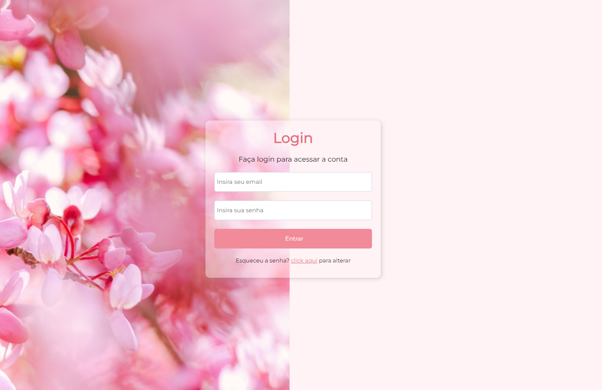

# Projeto Tela Login 
>Modulo 4/5 HTML5 e CSS3 - Curso em Video

 Projeto criado para o curso HTML5 e CSS3 módulo 4/5 do Curso em video - prof. Guanabara. Projeto resposnivo para Mobile, Tablets e Desktop.

 

### 📎[Acesse aqui](https://nicoletsingas.github.io/Projeto-Tela-Login/)
 

 
 

## 🛠 Tecnologias 

- HTML

- CSS

- Github

 
 

## ✨Contato

nick_monalisa@outlook.com